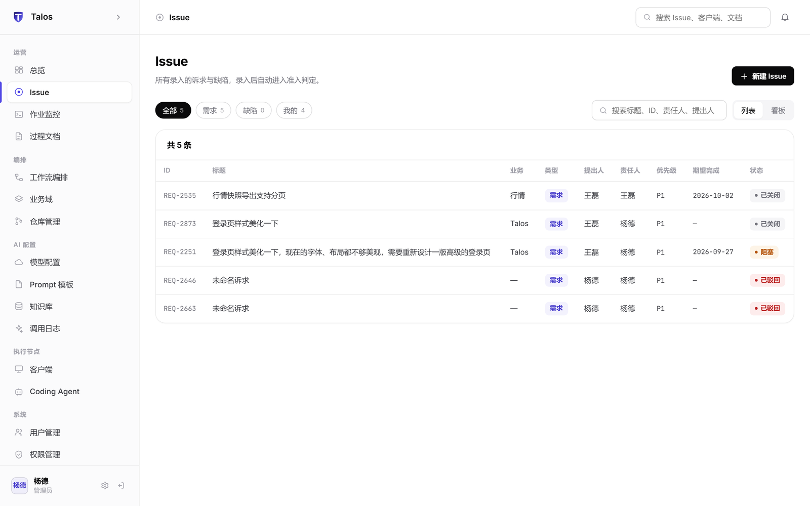
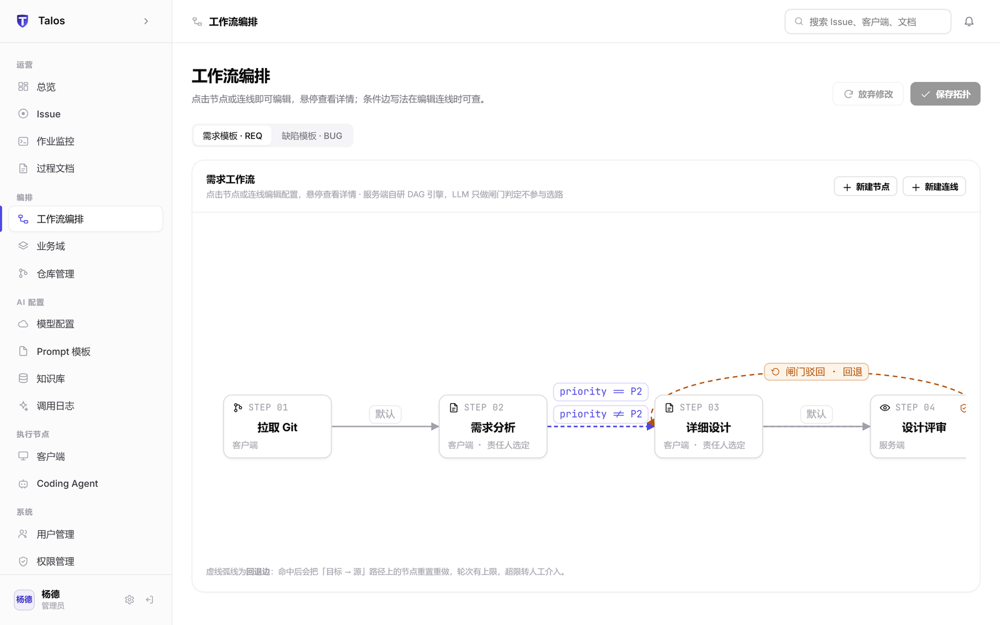
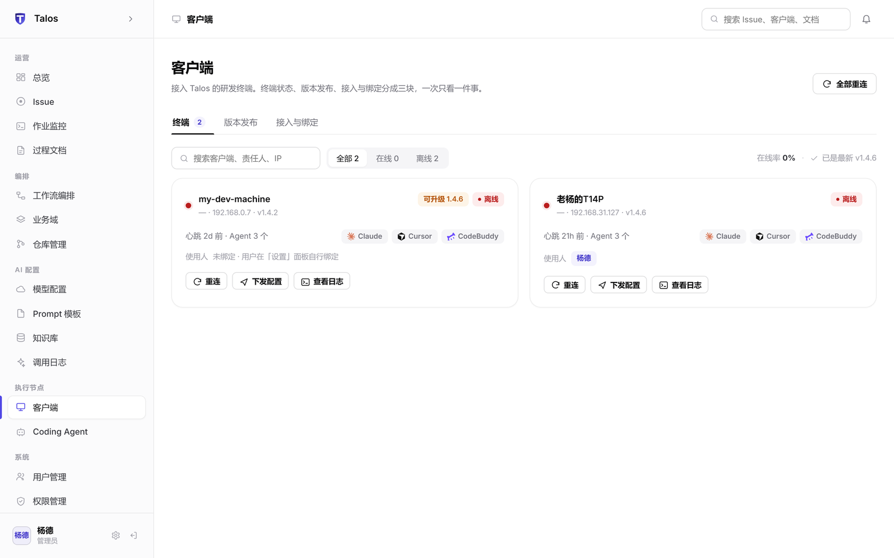
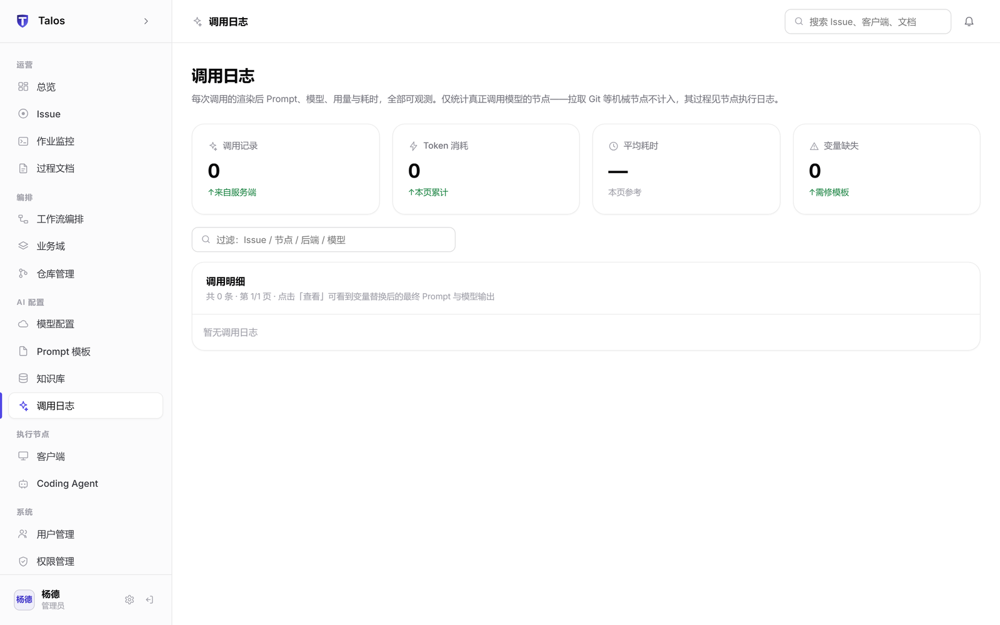
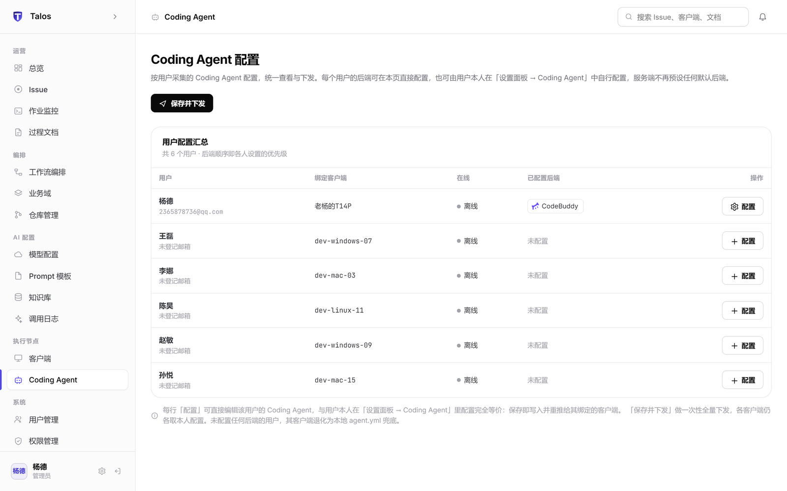
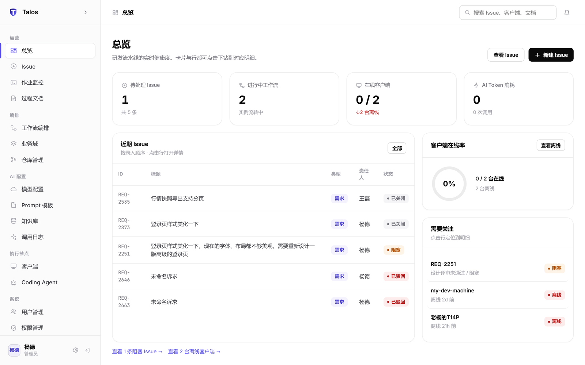
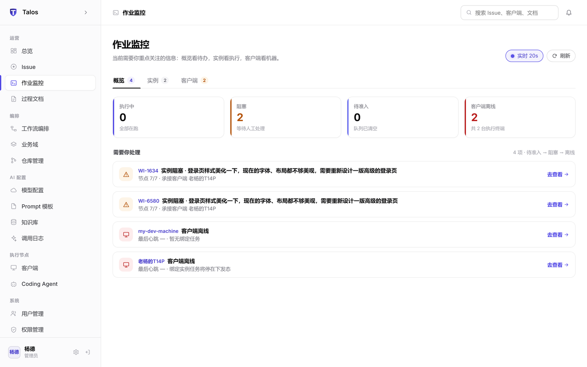

<div align="center">



**让交付自己发生 · Let delivery happen by itself**

[](https://openjdk.org/projects/jdk/17)
[](https://spring.io/projects/spring-boot)
[](https://grpc.io)
[](https://react.dev)
[](https://vitejs.dev)

**[在线体验](https://www.missyou.website/) · [文档中心](https://www.missyou.website/#/docs) · [客户端下载](https://www.missyou.website/#/download)**

简体中文 · [**English**](#-english--english-below)

</div>

<br/>

**Talos** 是一套研发周期全自动流程平台：Issue 录入后由服务端完成 **AI 准入判定 → 项目分拣 → 工作流编排**，再把节点下发到研发终端上的 **Coding Agent**（Claude Code / Cursor / Codex / CodeBuddy）真实执行，Prompt 渲染、模型用量、执行日志、过程文档全程回流服务端，**可观测、可审计、可人工接管**。

服务端只做编排与治理，代码与执行始终留在研发终端——**敏感代码不出内网**。

<br/>

<div align="center">

<p><sub>官网 · 架构 · 文档 · 下载 一站式入口 —— <a href="https://www.missyou.website/">www.missyou.website</a></sub></p>
</div>

<br/>

## 它解决什么问题

| 传统研发流水线的痛点 | Talos 的答案 |
| --- | --- |
| 需求/缺陷从录入到开工靠人肉流转，没人知道卡在哪 | 录入即准入：AI 判定 + 关键词 + 人工兜底，命中即生成执行上下文 |
| AI 编码工具各自为战，Prompt、密钥、产出散落个人机器 | 服务端统一编排，端侧 Agent 真实执行，配置即下发、产出即回流 |
| AI 调用是黑盒，谁也说不清花了多少钱、改了什么 | 每次调用的渲染后 Prompt / 模型 / Token / 耗时全部留痕可审计 |
| 交付过程不可信，不敢让 AI 碰正式仓库 | 分支隔离 · 测试门禁 · 仅提 MR · 失败回滚，全程人工闸门可接管 |

<div align="center">

<p><sub>控制台漫游：总览 → Issue → 工作流编排 → 作业监控 → 调用日志 → 客户端 → 用户</sub></p>
</div>

## 核心能力

### 智能准入与分拣

录入 Issue 自动完成准入判定与业务域识别：规则唯一命中直接放行，多命中交给 LLM 裁决，判定失败转人工——**全链路 fail-safe，绝不因为模型异常而放行**。

<div align="center"></div>

### 双轨工作流编排

需求（REQ）与缺陷（BUG）各自的标准链路可视化编排：拖拽连线即可配置节点、条件边（`priority == P2`）、人工闸门与回退策略；执行时按拓扑推进，闸门驳回自动回到目标节点重跑。

<div align="center"></div>

### 作业监控 · 实例拓扑

每个工作流实例实时渲染节点状态与拓扑图：节点级日志（客户端 trace + CLI 输出 + 服务端追加）按秒回传，阻塞实例一键人工通过 / 标记失败 / 从指定节点重跑。

<div align="center"></div>

### 端侧 Coding Agent

同一终端可挂载多后端，按优先级取用；配置保存在服务端用户个人配置里，保存即刻推送到绑定客户端——**服务端不落盘任何模型密钥**。

<div align="center"></div>

### 全链路可观测

AI 调用日志记录渲染后的 Prompt 与模型用量；过程文档（仓库准备 trace、Agent 产出）按 Issue 归档；客户端连接、心跳、版本发布一览无余。

<div align="center">
<table><tr>
<td></td>
<td></td>
</tr></table>
</div>

## 系统架构

```
                    ┌─────────────────────────────┐
                    │        Talos 服务端          │
                    │   编排 · 准入 · 配置 · 观测    │
                    │   Spring Boot 3 · H2 · gRPC  │
                    └──────────┬──────────────────┘
                               │ gRPC 双向流（客户端主动外连，NAT 友好）
                    ┌──────────┴──────────────────┐
                    │        研发终端 Daemon        │
                    │   常驻 · 心跳 · 拉取任务 · 回传  │
                    └──────────┬──────────────────┘
                               │ 本地 CLI 调用
                    ┌──────────┴──────────────────┐
                    │       Coding Agent 后端       │
                    │  Claude Code · Cursor · Codex │
                    └─────────────────────────────┘
```

- **反向长连接**：客户端位于 NAT 后，只主动向服务端发起 gRPC 双向流，无需暴露端口、无需 VPN。
- **机械节点与 Agent 节点**：`git` 类节点由服务端指挥客户端做纯机械操作（clone / fetch / 切分支），`doc / code / test` 节点交给 Coding Agent 真正读懂代码。
- **静默升级**：客户端上线时版本落后即自动完成 下载 → SHA256 校验 → 替换 → 重启，研发人员无感。

## 快速开始

> 完整部署文档见 [文档中心 · 接入指南](https://www.missyou.website/#/docs/guide)。

**1. 启动服务端**

```bash
git clone https://github.com/yonyong/Talos.git
cd Talos
mvn -DskipTests package
java -jar server/target/talos-server-*.jar     # HTTP :8080 · 客户端 gRPC :9443
```

**2. 打开控制台**

```bash
cd web && npm install && npm run dev           # 开发模式 http://localhost:5173
```

生产部署前端随服务端单 jar 发布，打开 `http://<server>:8080` 即用。首次登录用环境变量 `TALOS_ADMIN_EMAIL` 引导管理员账号，之后在「用户管理」登记邮箱、邮箱授权码登录。

**3. 接入研发终端**

在控制台「客户端 → 版本发布」上传客户端安装包（或 `client/build-package.bat` 打包），终端从下载页获取 zip，解压双击 `setup.bat`——自动注册计划任务保活并建立长连接。

Windows 一键产出部署包（含 CentOS 服务端部署脚本与 nginx 配置）：

```bat
package-server.bat     :: → dist/ 服务端部署包
package-agent.bat      :: → dist/ 客户端安装包
```

## 安全设计

- **反向连接 + 凭证接入**：客户端持凭证注册，服务端不下发模型密钥，Prompt 模板与配置由服务端治理。
- **任务 HMAC 签名**：每条下发指令带签名，客户端校验来源，杜绝伪造指令。
- **四道护栏**：分支隔离 · 测试门禁 · 仅提 MR · 失败自动回滚；人工闸门可随时接管。
- **RBAC 六角色**：管理员 / 技术负责人 / 开发 / 测试 / 产品 / 访客，按业务域隔离数据可见范围。
- **私有化推理**：涉代码场景强制走内网模型，敏感代码不出内网。

## 技术栈

| 层 | 技术 |
| --- | --- |
| 服务端 | Java 17 · Spring Boot 3.2 · gRPC 双向流 · H2（PostgreSQL 兼容模式）· JPA |
| 前端 | React 18 · Vite 5 · Hash Router · 零 UI 框架依赖的自绘组件 |
| 客户端 | Java 17 Daemon · Windows 计划任务保活 · 静默升级（SHA256 校验） |
| AI | OpenAI 兼容接口（Qwen / 智谱 / 私有化模型），准入 / 分拣 / 闸门全链路 fail-safe |

## 路线图

- [ ] 页面动作按角色渲染收敛
- [ ] 客户端 macOS / Linux 安装包
- [ ] 工作流模板市场与导入导出
- [ ] 更多 Coding Agent 后端适配

---

<div align="center">

**Talos** — 服务端编排，客户端执行，让交付自己发生。

<sub>在线体验：<a href="https://www.missyou.website/">https://www.missyou.website/</a></sub>

</div>

---

<!-- English -->

<a id="-english--english-below"></a>

## English

<div align="center">

</div>

**Talos** is an autonomous R&D delivery platform. Once an Issue is filed, the server runs **AI admission → project triage → workflow orchestration**, then dispatches nodes to **Coding Agents** (Claude Code / Cursor / Codex / CodeBuddy) running on developers' machines. Rendered prompts, model usage, execution logs and produced documents all flow back to the server — **observable, auditable, and human-takeover-ready**.

The server only orchestrates; code and execution stay on developer terminals — **sensitive code never leaves your intranet**.

| Pain point | Talos |
| --- | --- |
| Tickets routed by hand, progress invisible | Admission on entry: AI + rules + human fallback |
| AI tools fragmented across personal machines | Server-side orchestration, on-device execution, config pushed in one click |
| AI usage is a black box | Every call logged with rendered prompt, model, tokens, latency |
| AI touching production repos feels risky | Branch isolation · test gates · MR-only · auto rollback |

### Highlights

- **AI admission & triage** — deterministic rules first, LLM arbitration on ambiguity, fail-safe by design.
- **Dual-track workflow editor** — visual DAG for feature (REQ) and bug (BUG) flows with condition edges, human gates and auto re-run on rejection.
- **Live instance topology** — per-node logs streamed in seconds; blocked instances can be approved, failed or re-run from any node by hand.
- **Pluggable coding agents** — multiple backends per terminal, ordered by priority; keys stay server-side, config pushed instantly.
- **Full-chain observability** — prompt-level AI call logs, per-issue document archive, client fleet heartbeat & release management.

<div align="center">
<table><tr>
<td></td>
<td></td>
</tr></table>
</div>

### Architecture

```
Server (Spring Boot 3 · gRPC · H2)  ──gRPC bidi stream──  Developer Terminal Daemon
                                                              │ local CLI
                                                    Claude Code · Cursor · Codex · CodeBuddy
```

Clients sit behind NAT and only dial out to the server over a gRPC bidirectional stream — no inbound ports, no VPN. Mechanical `git` nodes are driven by the server; `doc / code / test` nodes go to coding agents. Outdated clients upgrade themselves silently (download → SHA-256 → replace → restart).

### Quick start

```bash
git clone https://github.com/yonyong/Talos.git
cd Talos && mvn -DskipTests package
java -jar server/target/talos-server-*.jar      # HTTP :8080 · agent gRPC :9443

cd web && npm install && npm run dev            # dev console on :5173
```

Open `http://localhost:8080`, bootstrap the admin with `TALOS_ADMIN_EMAIL`, then register user emails in the console and sign in with one-time email codes. Install agents on terminals via the download page (`setup.bat`).

### Security

Client credentials + HMAC-signed dispatch · branch isolation / test gates / MR-only / auto rollback · six-role RBAC scoped by business domain · code-sensitive inference forced to private models.

### Links

**[Live demo](https://www.missyou.website/)** · **[Docs](https://www.missyou.website/#/docs)** · **[Download](https://www.missyou.website/#/download)**
